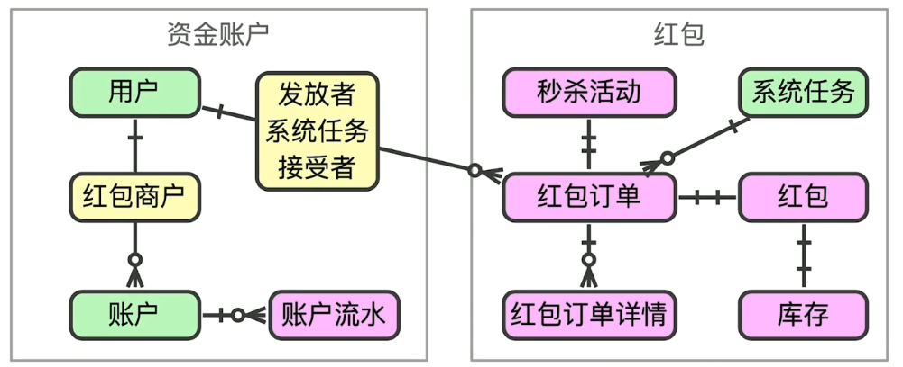
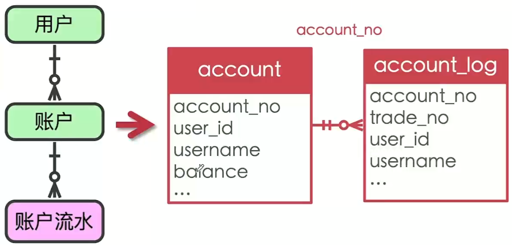

# Go-software-engineering
Go企业级开发单机到微服务的演变
单机->分布式->微服务
## 单机
### 简单的业务场景
- 红包业务
    - 红包:一定数量和金额的红包序列
        - 红包是具备虚拟资金特征的特殊商品
        - 发红包和收红包实际上是资金交易过程
        - 资金交易是资金从一个账户流向另一个账户的过程
- 红包业务模型

- 数据库物理模型设计
    - 从业务领域模型来推倒数据库物理模型
        - 物理模型和逻辑模型保持一致,可以保持不一致
        - 不能违背业务模型逻辑的前提下可以做一些优化
        - 冗余,合并,拆分,异构
    - 资金账户数据库表设计
    
    

        